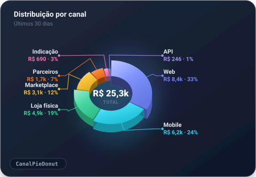
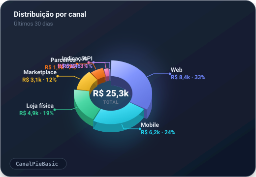

# gr-ui-charts

Gráficos SVG customizados, desenhados na mão em React — sem dependência de
libs de chart (Recharts, etc.), porque nenhuma delas suporta raio/altura
variável por fatia num pie/donut.

## Componentes

<table>
<tr>
<td align="center" width="50%">
<br/>
<b>CanalPieDonut</b> (recomendado)
</td>
<td align="center" width="50%">
<br/>
<b>CanalPieBasic</b>
</td>
</tr>
</table>

- **`CanalPieDonut`** (também exportado como `CanalPie`) — versão atual,
  recomendada. Donut 3D com raio e altura proporcionais ao valor de cada
  fatia, hover que levanta a fatia, rótulos externos roteados em leque (nunca
  cruzam o pie nem se sobrepõem — repare como "Categoria C" e "Categoria D"
  não colidem, ao contrário da variante Basic ao lado), fatia mínima para
  categorias zeradas, e texto central que encolhe sozinho conforme o valor
  cresce.
- **`CanalPieBasic`** — variante mais simples (sem hover, sem roteamento
  anti-colisão de rótulos), uma versão anterior mantida como referência.

## Uso

```tsx
import { CanalPie, type CanalPieDado } from 'gr-ui-charts';

const dados: CanalPieDado[] = [
  { name: 'Categoria A', value: 10566.55, color: 'var(--chart-purple)' },
  { name: 'Categoria B', value: 4649.85, color: 'var(--chart-cyan)' },
];

<CanalPie dados={dados} totalLabel="R$ 15,2k" />
```

## Requisitos do app hospedeiro

- **React 18+** (peer dependency).
- **Tokens CSS de tema**: os componentes usam `var(--foreground)` e
  `var(--muted-foreground)` para texto — defina-os no seu `theme.css` (padrão
  shadcn/ui) ou passe cores fixas via `dados[].color`.
- **Tailwind + tailwindcss-animate** (opcional): as classes
  `animate-in fade-in zoom-in-90 duration-700` dão a animação de entrada. Sem
  o plugin, o componente funciona normalmente, só sem essa animação.
- **Tailwind v4 `@source`**: se instalado via dependência git (código-fonte
  puro, sem build), adicione uma entrada `@source` apontando para
  `node_modules/gr-ui-charts/src` no seu `tailwind.css`, senão as classes
  usadas só dentro deste pacote são podadas do CSS final:
  ```css
  @source '../../node_modules/gr-ui-charts/src/**/*.tsx';
  ```

## Instalação (dependência git, sem publicação no npm)

```bash
npm install git+https://github.com/01010100hiago/gr-ui-charts.git
```

Distribuído como TSX fonte puro (sem etapa de build) — o bundler do projeto
consumidor (Vite/esbuild, Next, etc.) compila os arquivos deste pacote junto
com os seus.

### Usando em um build Docker (Alpine)

`npm ci` precisa do binário `git` pra resolver dependências git, e o
lockfile do npm normaliza URLs de repositórios do GitHub pra `git+ssh`
mesmo quando você usa `https` no `package.json` — sem chave SSH no
container, isso falha. Solução: instalar `git` e reescrever `ssh` → `https`
no Dockerfile antes do `npm ci`:

```dockerfile
RUN apk add --no-cache git \
  && git config --global url."https://github.com/".insteadOf "ssh://git@github.com/"
```
